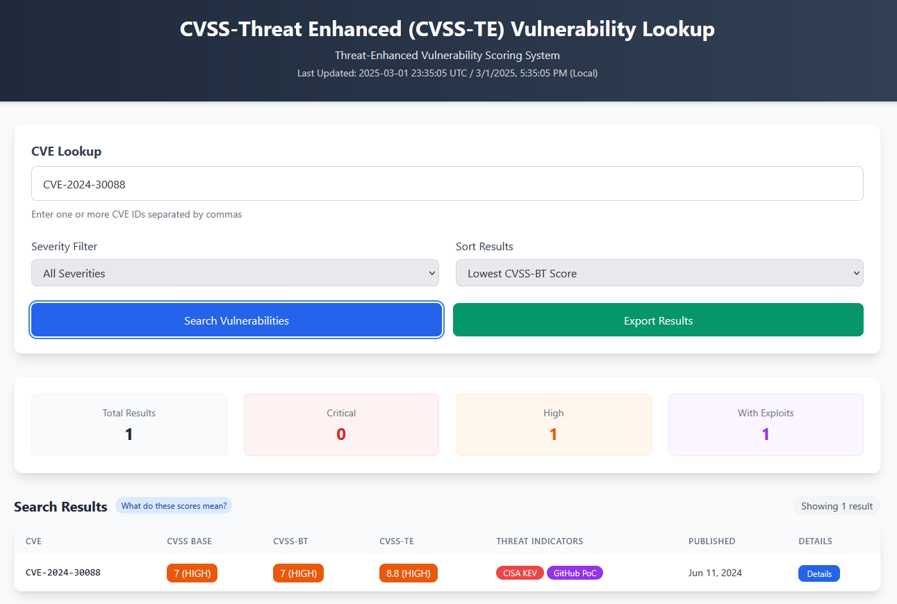

# CVSS-TE: Threat-Enhanced Vulnerability Scoring System

Thank you to the original author of the tool [cvss-bt](https://github.com/t0sche/cvss-bt) 

## Overview

The Common Vulnerability Scoring System (CVSS) is an industry standard for assessing the severity of security vulnerabilities. While the National Vulnerability Database (NVD) provides CVSS Base scores, these alone are insufficient for effective vulnerability prioritization. 

This repository enhances vulnerability scoring through two complementary approaches:

1. **CVSS-BT (Base + Temporal)**: Enriches standard CVSS scores by incorporating the Exploit Code Maturity/Exploitability (E) Temporal Metric using the official CVSS specification.
2. **CVSS-TE (Threat-Enhanced)**: An advanced scoring system that extends beyond CVSS-BT by incorporating detailed exploit quality metrics and additional threat intelligence context.

## Interactive Web Application

**Live Web Interface**: [CVSS-TE Threat Intelligence Dashboard](https://kston83.github.io/cvss-te/)

The CVSS-TE web application provides a comprehensive threat intelligence platform with two main interfaces:

### Threat Intelligence Dashboard (Landing Page)

The dashboard provides immediate visibility into the current threat landscape with three priority-focused sections:

- **CISA Known Exploited Vulnerabilities**: Displays the most recently added vulnerabilities to CISA's KEV catalog, sorted by official date added. These represent mandatory patching requirements for federal agencies and critical threats confirmed to be exploited in the wild.

- **Recently Published Vulnerabilities**: Shows newly published CVEs from the last 7, 14, or 30 days, providing early awareness of emerging vulnerabilities before exploitation occurs.

- **Emerging Threats**: Identifies recent vulnerabilities (last 30-90 days) that exhibit exploitation signals including EPSS scores above 30%, public exploit availability (Metasploit, ExploitDB, Nuclei, GitHub PoCs), or CISA KEV status. This section highlights new vulnerabilities that pose immediate risk.

The dashboard automatically enriches data with official CISA KEV information, including the date each vulnerability was added to the catalog, due dates for remediation, and known ransomware campaign usage. KEV data is fetched from CISA's live JSON feed and cached locally for 24 hours to ensure up-to-date information while maintaining performance.

### CVE Lookup Tool

A dedicated search interface for detailed vulnerability analysis:

- Search and filter vulnerabilities by CVE ID
- Sort by multiple criteria (CVSS-TE score, EPSS, publication date)
- Filter by severity level (Critical, High, Medium, Low)
- Detailed vulnerability insights with scoring comparisons
- Threat indicator visualization (exploit availability, KEV status)
- Export results to CSV for further analysis
- Direct URL linking for sharing specific CVE searches

### Key Features

- **Enhanced CVE Cards**: Display both CVSS-TE and Base scores with clear labels, vulnerability descriptions, EPSS scores, vendor information, and threat indicators
- **Real-time KEV Enrichment**: Automatically fetches and merges official CISA KEV catalog data including date added, due dates, and ransomware usage indicators
- **Sortable Sections**: All dashboard sections support sorting by CVSS-TE score, publication date, or EPSS score
- **Responsive Design**: Fully functional on desktop, tablet, and mobile devices
- **No Backend Required**: Pure client-side application with data loaded from static CSV file
- **Privacy-Focused**: Minimal analytics, no user tracking, all processing done locally

## Data Sources

This repository continuously enriches and publishes vulnerability scores based on multiple threat intelligence sources:

- [CISA Known Exploited Vulnerabilities (KEV) Catalog](https://www.cisa.gov/known-exploited-vulnerabilities-catalog)
- [VulnCheck KEV](https://vulncheck.com/kev)
- [EPSS (Exploit Prediction Scoring System)](https://www.first.org/epss/)
- [Metasploit Framework](https://www.metasploit.com/)
- [Nuclei Templates](https://github.com/projectdiscovery/nuclei-templates)
- [Exploit DB](https://www.exploit-db.com/)
- [PoC-in-GitHub](https://github.com/nomi-sec/PoC-in-GitHub)

## CVSS-BT Scoring Logic

### Temporal Metric - Exploit Code Maturity/Exploitability (E)

The CVSS-BT score incorporates the Exploit Code Maturity/Exploitability (E) Temporal Metric based on available threat intelligence. This metric uses a prioritized decision tree to categorize vulnerabilities:

| Value | Description | Assigned When |
|-------|-------------|---------------|
| **Attacked (A)** (CVSS 4.0) | Vulnerability has verified attacks in the wild or widely available exploit solutions | • Found in CISA KEV or VulnCheck KEV • EPSS score ≥ 0.36 • Has Metasploit module (for CVSS 4.0) |
| **High (H)** (CVSS 2.0/3.0/3.1) | Functional autonomous code exists with reliable exploitation | • Found in CISA KEV or VulnCheck KEV • EPSS score ≥ 0.36 • High-quality Metasploit module (quality score ≥ 0.8) |
| **Functional (F)** (CVSS 2.0/3.0/3.1) | Functional exploit code is available that works in most situations | • Has Metasploit module (quality score < 0.8) • Has Nuclei template • Multiple high-quality PoCs (quality score ≥ 0.8 with multiple sources) |
| **Proof-of-Concept (P)** (CVSS 3.0/3.1/4.0) | Proof-of-concept exploit code is available but may not work in all situations | • Found in ExploitDB • Has GitHub PoC |
| **Unproven (U)** / **Unreported (U)** | No exploit code is available, or an exploit is theoretical | • Not present in any of the above threat intelligence sources |

### EPSS Threshold Explanation

The EPSS threshold of 0.36 (36%) is based on the F1 score of the EPSS v3 model. At approximately 37%, a CVE is highly likely to have weaponized exploit code available. This threshold is used as a signal for the "High" or "Attacked" exploit maturity designations.

## CVSS-TE Scoring Logic

The CVSS-TE score builds upon the CVSS-BT approach by incorporating additional dimensions:

1. **Base CVSS-BT Score**: Starting with the temporal score that already accounts for exploit maturity
2. **Exploit Quality Metrics**: Assessing the reliability, ease of use, and effectiveness of available exploits
3. **Threat Intelligence Context**: Incorporating additional threat landscape factors

### Exploit Quality Assessment

Each exploit source is evaluated based on three key metrics:

| Source | Reliability | Ease of Use | Effectiveness |
|--------|------------|-------------|---------------|
| Metasploit | 0.9 | 0.8 | 0.85 |
| ExploitDB | 0.7 | 0.6 | 0.7 |
| Nuclei | 0.8 | 0.9 | 0.75 |
| GitHub PoC | 0.5 | 0.4 | 0.6 |
| CISA KEV | 0.95 | 0.7 | 0.9 |
| VulnCheck KEV | 0.9 | 0.7 | 0.85 |

For Metasploit exploits, we further refine the reliability rating by incorporating the actual reliability and rank information from the module metadata when available.

The overall quality score is calculated using a weighted approach:
- 70% weight is given to the highest-quality exploit
- 30% weight is assigned to the average of the remaining exploit sources

This prevents the dilution of high-quality weaponized exploits by lower-quality proof-of-concept exploits.

The final weighting for the three quality dimensions is:
- Reliability (40% weight)
- Ease of Use (30% weight)
- Effectiveness (30% weight)

### CVSS-TE Calculation

The CVSS-TE score is calculated using the following formula:

`CVSS-TE = min(10, CVSS-BT_Score * Quality_Multiplier + Threat_Intel_Factor - Time_Decay)`

Where:

**Quality Multiplier**: Ranges from 0.8-1.2 based on exploit quality
- For exploited vulnerabilities: 0.8 + (quality_score * 0.4)
- For unexploited vulnerabilities with EPSS < 0.36: 0.95 (slight penalty for lack of exploitation evidence)
- For unexploited vulnerabilities with EPSS ≥ 0.36: 1.0
- Range: Poor quality exploits closer to 0.8 (reducing the base severity), high quality exploits up to 1.2 (increasing the base severity)

**Threat Intel Factor**: Adds 0-2 points based on additional threat intelligence
- CISA KEV presence: +1.0
- VulnCheck KEV presence (if not in CISA KEV): +0.8
- High EPSS score (≥ 0.5): +0.5
- Moderate EPSS score (≥ 0.36): +0.25
- If both KEV and high EPSS are present, uses the maximum value instead of adding them together
- Exploit source count:
  - 5 or more exploit sources: +0.75
  - 3-4 exploit sources: +0.5
  - 2 exploit sources: +0.25
  - 0-1 exploit sources: +0.0

**Time Decay**: Reduces score for older, unexploited vulnerabilities
- For vulnerabilities >5 years old with no exploits: min(0.2, (years_since_pub - 5) * 0.04)
- Maximum reduction of 0.2 points for very old vulnerabilities
- No reduction for vulnerabilities less than 5 years old

### CVSS-TE Severity Levels

| CVSS-TE Score | Severity Level |
|---------------|----------------|
| 9.0 - 10.0 | CRITICAL |
| 7.0 - 8.9 | HIGH |
| 4.0 - 6.9 | MEDIUM |
| 0.1 - 3.9 | LOW |
| 0.0 | NONE |

## Default Behavior When No Threat Intelligence Exists

When a vulnerability has no data from any external threat intelligence sources:

**For CVSS-BT**:
- The Exploit Code Maturity value defaults to "Unproven" (E:U) or "Unreported" (E:U) for CVSS 4.0
- This typically results in a temporal score that is lower than the base score
- For CVSS 3.0/3.1, an E:U value applies a multiplier of 0.91 to the base score
- For CVSS 4.0, an E:U value applies a similar reduction

**For CVSS-TE**:
- The Quality Multiplier defaults to 0.95 for low EPSS or 1.0 for high EPSS (as there are no exploits to evaluate)
- The Threat Intel Factor is 0.0 (no intelligence signals to consider)
- For older vulnerabilities, a time decay factor may be applied

## Practical Application

A key benefit of CVSS-TE is its ability to reduce noise in vulnerability management by providing more accurate threat context:

1. **Reduces False Positives**: Vulnerabilities with high base scores but no exploits in the wild are appropriately downgraded
2. **Highlights True Threats**: Vulnerabilities actively being exploited are properly prioritized
3. **Contextualizes Vulnerability Feeds**: Helps security teams filter through overwhelming CVE volumes

## Example Interpretations

### Example 1: Reducing Noise
**CVE with Base Score 9.1**
- CVSS-BT Score: 7.3 (High)
- CVSS-TE Score: 6.8 (Medium)
- Demonstrates downgrading of vulnerabilities with limited exploitation evidence

### Example 2: Highlighting True Threats
**CVE with Base Score 7.5**
- CVSS-BT Score: 6.5 (Medium)
- CVSS-TE Score: 8.3 (High)
- Shows elevation of scores for vulnerabilities with high-quality exploits and active threats

### Example 3: Clarifying Risk Levels
**CVE with Base Score 5.5**
- CVSS-BT Score: 5.5 (Medium)
- CVSS-TE Score: 7.8 (High)
- Highlights vulnerabilities with significant real-world threat potential

## Caveats and Considerations

- CVSS-TE is a custom approach to vulnerability prioritization
- Exploit quality metrics are based on empirical observations
- Scores should be considered alongside other contextual factors

## Standards Compliance

Compatible with:
- CVSS 2.0
- CVSS 3.0 
- CVSS 3.1
- CVSS 4.0

## Acknowledgements

This product uses VulnCheck KEV and EPSS scores but is not endorsed or certified by the EPSS SIG or VulnCheck.